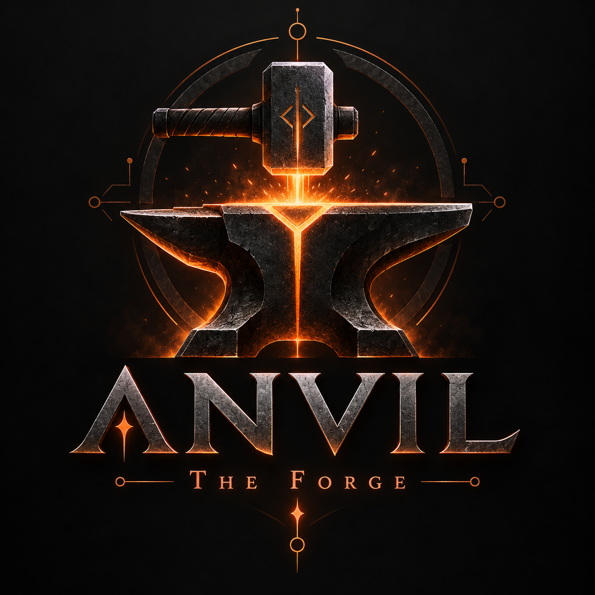
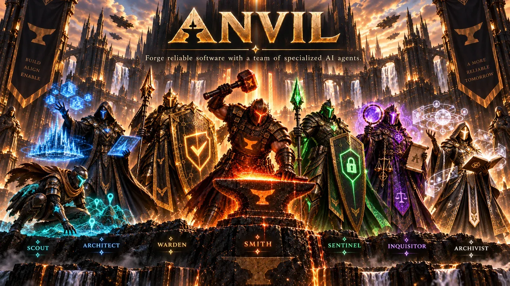
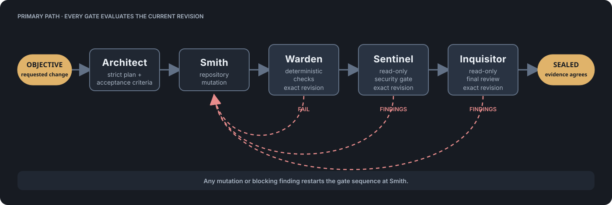
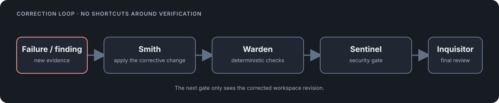
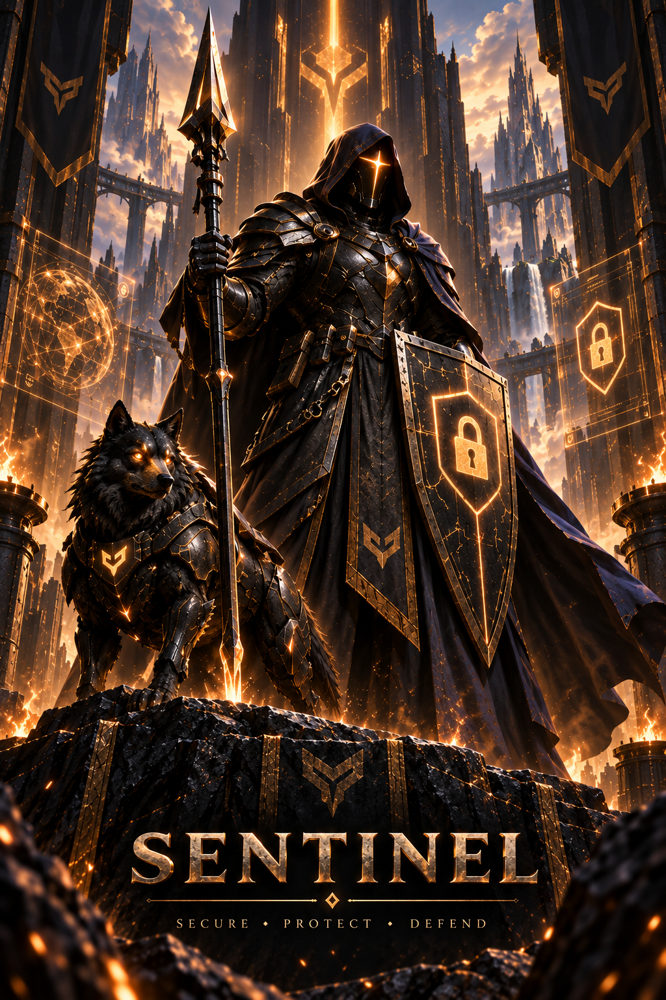

<div align="center">
  
  <h1>Anvil</h1>
  <p><strong>Forge reliable software with a team of specialized AI agents.</strong></p>
  <p>
    <a href="#quick-start">Quick start</a> ·
    <a href="#the-forge">The Forge</a> ·
    <a href="#configuration">Configuration</a> ·
    <a href="#safety-invariants">Safety</a>
  </p>
</div>

<p align="center">
  
</p>

Anvil is an OMP extension for taking a software objective from a written plan to a verified workspace revision. The user-facing workflow command is **`/forge`**; **`/anvil`** handles configuration, diagnostics, run management, and updates. Behind those commands, Anvil runs a deterministic, persistent workflow engine that coordinates the **Architect**, **Smith**, **Warden**, **Sentinel**, and **Inquisitor**.

Unlike prompt-only agent chains, the Forge records state and evidence as it works. Findings return to the Smith for correction, every code mutation invalidates earlier verification, and a run is only **Sealed** when checks, security, and review pass against the same workspace revision.

## Why Anvil

| Property | What it means in practice |
| --- | --- |
| Deterministic control flow | TypeScript owns every transition. Workers never choose the next state. |
| Exact revision gates | Git plus untracked-file fingerprints make stale passes unusable. |
| Resumable state | SQLite owns the run. JSON and text artifacts hold the evidence. |
| Bounded handoffs | Workers receive structured references, not replayed transcripts. |
| Cyclic correction | Review findings return through Smith, Warden, Sentinel, and Inquisitor. |
| Replaceable specialists | Agent names and model roles are configuration, not hard-coded providers. |

## The Forge

The lifecycle is deliberately linear between corrections. Each gate evaluates the exact current revision; a failure or blocking finding sends the run back to the Smith instead of allowing a stale pass to continue.

<p align="center">
  
</p>

The correction path is never a shortcut around verification:

<p align="center">
  
</p>

Every Smith mutation starts the gate sequence again. Read-only gates also verify before-and-after workspace fingerprints, so a mutation during security or review cannot be mistaken for a pass.

## The specialists

<table>
<tr>
<td width="50%"><br /><strong>Architect</strong><br />Plans the change and acceptance criteria.</td>
<td width="50%"><br /><strong>Smith</strong><br />Writes and repairs the repository.</td>
</tr>
<tr>
<td><br /><strong>Warden</strong><br />Runs checks, scanners, and policy commands.</td>
<td><br /><strong>Sentinel</strong><br />Audits the exact current revision.</td>
</tr>
<tr>
<td><br /><strong>Inquisitor</strong><br />Reviews correctness and maintainability.</td>
<td><br /><strong>Scout</strong><br />Optional focused repository reconnaissance.</td>
</tr>
</table>

<p align="center"><br /><strong>Archivist</strong><br />Optional durable project knowledge. Memory never owns workflow correctness.</p>

## Quick start

Install Anvil through OMP. A new OMP session or restart of OMP is required after installation so it loads Anvil. In that first session, Anvil automatically creates the editable global settings template and shows its exact path in the OMP notification area; it does not modify the current repository during this first-run setup.
```bash
# Register the Anvil marketplace and install the stable release
omp plugin marketplace add MSpiechowicz/oh-my-pi-anvil
omp plugin install oh-my-pi-anvil@omp-anvil --scope user

# After installing, open a new OMP session or restart OMP so Anvil loads.
# Inspect the global configuration and both global storage paths:
/anvil config

# Verify the installation:
/anvil doctor

# From the repository where you want a project overlay. Running this from
# a subdirectory still targets the repository root.
/anvil init

# The objective text is the Forge start point; no "start" subcommand is needed.
/forge "Add scoped API-key rotation with a backwards-compatible rollout"
```

The automatic first-run setup creates the global file at `$XDG_CONFIG_HOME/omp/anvil.yml` when `XDG_CONFIG_HOME` is set, or at `~/.config/omp/anvil.yml` otherwise. If the file already exists, startup leaves it unchanged and shows no repeated setup notification. `/anvil init` creates the optional project overlay at the repository root as `.omp/anvil.yml`. Missing files are created as editable text; existing settings are preserved.

Forge loads settings in this order, with later values taking precedence:

1. built-in defaults;
2. the global user file;
3. the nearest repository `.omp/anvil.yml` overlay.

The project overlay is intentionally small: put shared checks and agent choices in the global file, then add only repository-specific overrides to `.omp/anvil.yml`.

With an interactive OMP UI, `/anvil` without arguments opens a management menu; the explicit subcommands remain available for scripts and non-interactive sessions.

Inspect and control an existing run through `/anvil`:

```text
/anvil status [run-id]
/anvil resume run_<id>
/anvil findings run_<id>
/anvil cancel run_<id>
```

## Marketplace installation and updates

Register the Anvil marketplace and install the stable release through OMP:

```bash
omp plugin marketplace add MSpiechowicz/oh-my-pi-anvil
omp plugin install oh-my-pi-anvil@omp-anvil --scope user
```

Anvil exposes the native update path from inside OMP:

```text
/anvil update check
/anvil update install
```

The standalone command-line entrypoint is also available when the package is on your `PATH`:

```bash
anvil-update check
anvil-update install
```

Updates verify the published stable GitHub release, refresh the registered marketplace, upgrade only the active unambiguous Anvil installation, and confirm that OMP installed a newer version. Source checkouts are never overwritten; update those with `git pull --ff-only`, then run `deno task build`.
Interactive OMP startups also request a fresh public release check in the background. A managed installation shows `Anvil update available. Run /anvil update install to update it.` as a warning when a newer stable release exists; `/anvil update check` reports its result as a single plain line such as `Anvil 0.1.11: No newer release available.` Startup failures stay quiet and no code is installed automatically. Source checkouts do not show this marketplace-update warning.

## Configuration

The V1 workflow is intentionally fixed. Configuration controls specialists, deterministic checks, policies, budgets, persistence, and memory, while the state machine remains code-owned. Settings are assembled from built-in defaults, the global user file, and an optional project overlay; project values override global values.

The shared global file is:

```text
$XDG_CONFIG_HOME/omp/anvil.yml
```

When `XDG_CONFIG_HOME` is not set, Forge uses:

```text
~/.config/omp/anvil.yml
```

OMP's global model-role mappings are stored in `~/.omp/agent/config.yml` by default, or in `$PI_CODING_AGENT_DIR/config.yml` when a custom agent directory is active. Named profiles use their profile agent directory. `/anvil config` prints the active paths.

The optional repository-specific overlay is:

```text
<repository-root>/.omp/anvil.yml
```

For example, keep common agent mappings and checks in the global file, then customize one repository with a small overlay:

```yaml
# $XDG_CONFIG_HOME/omp/anvil.yml
agents:
  planner: # Architect
    agent: architect
  implementation: # Smith
    agent: smith
checks:
  - id: typecheck
    command: [deno, task, typecheck]
    required: true
    timeoutMs: 180000
```

```yaml
# <repository-root>/.omp/anvil.yml
# Values here override the global settings for this repository.
agents:
  implementation: # Smith
    agent: my-repository-smith
checks:
  - id: lint
    command: [deno, task, lint]
    required: true
    timeoutMs: 120000
```

An overlay can contain only the fields it needs. In this example, the project `checks` list replaces the inherited list, while the other global and default values remain in effect.

The complete configuration shape is:

```yaml
version: 1
workflow:
  name: secure-code-change

agents:
  planner: # Architect
    agent: architect
  implementation: # Smith
    agent: smith
  security: # Sentinel
    agent: sentinel
  review: # Inquisitor
    agent: inquisitor
checks:
  - id: typecheck
    command: [deno, task, typecheck]
    required: true
    timeoutMs: 180000

security:
  failOn: [critical, high, medium]
  maxAttempts: 3

review:
  maxAttempts: 3

implementation:
  maxAttempts: 6

budgets:
  maxTotalTokens: 250000
  maxTotalRequests: 120
  maxTransitions: 40

context:
  maxInlineChars: 12000
  maxMemoryItems: 5

memory:
  enabled: true
  retainOnSuccess: true
```

Model selection stays in OMP's global model-role configuration:

```yaml
modelRoles:
  architect: "provider/planner:xhigh"
  smith: "provider/coding:xhigh"
  sentinel: "provider/security:xhigh"
  inquisitor: "provider/review:high"
```

The Warden is deterministic and has no model mapping. The default agent definitions reference the canonical aliases above. Anvil never chooses a provider for you. For the complete configuration reference, see [Configuration](docs/configuration.md).

## Persistence and recovery

Runtime state lives under `.omp/.anvil/` by default.

```text
.omp/.anvil/
├── anvil.db
├── lock.json
└── runs/<run-id>/
    ├── objective.md
    ├── effective-config.json
    ├── plan.json
    ├── artifacts/
    │   ├── planner/
    │   ├── implementation/
    │   ├── checks/
    │   ├── security/
    │   └── review/
    └── logs/
```

SQLite is authoritative for workflow state. Artifacts are hashed and written atomically. Runtime files are excluded from the workspace revision; source edits are not.

Recovery is state-aware:

- interrupted planning reruns the planner;
- interrupted implementation recomputes the revision and runs checks if files changed;
- interrupted checks rerun checks;
- interrupted security or review reruns the read-only gate after revision validation.

Anvil never resets the repository, cleans user files, stages changes, commits, or pushes.

## Safety invariants

A run cannot reach `DONE` (**Sealed**) unless all of these are true:

1. current workspace revision equals the revision recorded by the run;
2. checks have a passing result for that exact revision and effective config;
3. security has a passing result for that exact revision and policy;
4. review has a passing result for that exact revision and policy;
5. no blocking findings remain open;
6. budgets and transition limits were not exceeded.

Security and review are read-only by contract and by before/after fingerprint verification. A mutation invalidates the result and routes the run back through Warden.

## Token discipline

Handoffs contain:

- objective and plan artifact pointers;
- current revision and mutation epoch;
- active acceptance criteria;
- open finding IDs, summaries, and evidence references;
- changed-file names with a hard cap;
- bounded durable memory snippets.

Full logs remain artifacts. Full transcripts are never passed between workers. Historical attempts do not enlarge a current handoff when the open findings and revision stay constant.

## OMP compatibility boundary

The workflow engine depends on `AgentRunner`, `RevisionProvider`, and `CheckRunner`. OMP-specific discovery and child execution are isolated in `src/runners/omp-compat.ts` and `src/runners/omp-subprocess-runner.ts`.

The package follows the extension and task-agent concepts documented by OMP. Internal OMP signatures evolve, so only the compatibility adapter should need significant changes after an OMP upgrade.

## Development

```bash
deno task typecheck
deno task test
deno task build
```

The repository runs on Deno and standard Node-compatible APIs supplied by the OMP host. Unit and integration tests use injected fake agents and revision providers, so state-machine correctness does not spend model tokens.

## License

GPL-3.0-only. See [LICENSE](LICENSE).
