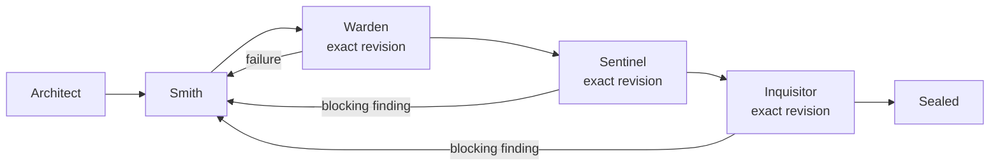

# Configuration

Forge assembles an effective configuration before a run. The global user settings file is loaded by default, and an optional repository overlay can override it. The canonical project overlay is `.omp/anvil.yml`; `/forge` runs an objective and `/anvil` manages configuration, diagnostics, runs, and updates.

## Configuration locations and precedence

Settings are merged in this order:

1. built-in `DEFAULT_CONFIG`;
2. the global user file, `$XDG_CONFIG_HOME/omp/anvil.yml`;
3. the nearest project overlay, `.omp/anvil.yml`.

If `XDG_CONFIG_HOME` is not set, the global Anvil path is `~/.config/omp/anvil.yml`. OMP's global model-role mappings are stored in `~/.omp/agent/config.yml` by default, or in `$PI_CODING_AGENT_DIR/config.yml` when a custom agent directory is active. Named profiles use their profile agent directory. Both configuration files are editable YAML. The Anvil global file is optional; when it is absent, Forge continues with built-in defaults.

On the first OMP session after installation, Anvil automatically creates the Anvil global file if it is missing and shows a notification with the exact path to edit. A new OMP session or restart of OMP is required after installation so Anvil can load and perform this setup. It does not modify the current repository during this automatic setup. Existing global settings are left unchanged, so the notification is not repeated on later sessions.

Inspect the active paths and verify the installation:

```text
/anvil config
/anvil doctor
/anvil init
/anvil update check
```


Initialization creates the missing global file and, at the repository root, creates a small editable `.omp/anvil.yml` overlay. It never overwrites existing global or project settings. Running initialization from a repository subdirectory still targets that repository root. If either file already exists, initialization reports it instead of replacing it.
`/anvil config` reports schema-valid settings as `STATUS VALID` even when the optional global file is absent. That does not establish execution readiness: Warden still needs explicit or automatically discovered checks before `/forge` can proceed. It also marks the global file and project overlay as `present` or `not present`; run `/anvil init` when this repository needs its `.omp/anvil.yml` overlay.


The generated project overlay is intentionally sparse so shared global values continue to apply. Add only repository-specific overrides, for example:

```yaml
# $XDG_CONFIG_HOME/omp/anvil.yml
agents:
  implementation: # Smith
    agent: smith
checks:
  - id: typecheck
    command: [deno, task, typecheck]
    required: true
    timeoutMs: 180000
```

```yaml
# <repository-root>/.omp/anvil.yml
# Values here override the global settings for this repository.
agents:
  implementation: # Smith
    agent: my-repository-smith
checks:
  - id: lint
    command: [deno, task, lint]
    required: true
    timeoutMs: 120000
```

Here the project-specific agent replaces the global implementation agent, and the project `checks` list is the repository's configured checks list. Other global and default settings remain in effect.

## Warden verification requirements

Warden is a command runner, not a model agent. After merging defaults, global settings, and the project overlay, Forge automatically discovers supported verification commands when the effective `checks` list is empty. A nonempty explicit list is preserved unchanged and disables discovery. A project `checks: []` replaces inherited checks and requests discovery rather than disabling verification.

Discovery only reads project manifests and lockfiles; it does not execute scripts during configuration loading or write discovered checks into either settings file. The discovered list becomes part of the effective configuration before validation, hashing, and planning. If it is still empty, a run stops with `CONFIG_INVALID` before any model invocation instead of recording an empty passing gate. For unsupported projects, configure executable commands explicitly.

Discovery supports these root manifests, not a recursive workspace scan:

- **`package.json` scripts:** verification names such as `check`, `typecheck`, `type-check`, `type_check`, `lint`, `test`, and `build`, including conventional colon-, hyphen-, or underscore-separated variants. Only nonempty commands without detected watch, development-server, interactive UI, or mutation modes are eligible; watch/dev/serve/start/fix/format/write/update variants are excluded.
- **`deno.json` or `deno.jsonc` tasks:** the same verification-name and finite-command rules apply. `deno.json` takes precedence over `deno.jsonc`. Native Deno tasks take precedence over same-name package scripts, and package wrappers for those tasks are not duplicated.
- **Package-manager choice:** a recognized `packageManager` declaration (`npm`, `pnpm`, `yarn`, or `bun`) wins. When that declaration is absent, Forge checks lockfiles in this order: `pnpm-lock.yaml`, `yarn.lock`, `bun.lock`/`bun.lockb`, then `package-lock.json`/`npm-shrinkwrap.json`; without a match it uses `npm`. An invalid or unsupported declaration causes `CONFIG_INVALID` instead of silently choosing another manager. Deno tasks use `deno task`.
- **Finite command filtering:** simple commands and `&&` chains are supported. Opaque shell constructs such as command substitution, background execution, pipelines, and redirection, as well as known watch/process orchestrators and unsafe flags, are excluded. Referenced scripts and package lifecycle hooks are inspected too.
- **One-shot tests:** a direct bare Vitest command receives `run`; Vitest with options receives `--run`; a direct Jest command receives `--ci`. npm forwards these arguments through `--`. Wrappers that would need runner arguments injected into a nested command are skipped in favor of discovering the eligible leaf script. Explicit watch or mutation modes are excluded rather than silently run. Discovery is a conservative filter, not a sandbox or a proof that arbitrary script bodies and their dependencies are safe.
- **Check definitions:** IDs are the original script/task names, such as `check`, `test`, or `test:unit`, with `required: true` and `timeoutMs: null` (no timeout). Set a positive timeout in milliseconds to opt in. Deno tasks appear in name order, followed by unmatched package scripts in name order.
- **Manifest errors:** missing optional manifests are ignored, but malformed manifests or invalid script/task entries cause `CONFIG_INVALID`. An explicit nonempty checks list bypasses discovery, including these manifest checks.

At least one effective check must be required, either through `required: true` or Architect's `requiredChecks`. Architect receives the effective IDs, including discovered checks; an unknown plan-required ID or a plan with no effective required check is rejected before Smith starts. A plan-required check is authoritative even if its configured `required` flag is false: its failure stops the gate and participates in fail-fast behavior. Browser/manual verification belongs in acceptance criteria and Smith's verification evidence, not an invented Warden command ID.

To override discovery for a repository that exposes Yarn `check` and `build` scripts, a project overlay can use:

```yaml
checks:
  - id: typecheck
    command: [yarn, check]
    required: true
    timeoutMs: 180000
  - id: build
    command: [yarn, build]
    required: true
    timeoutMs: 180000
```

Choose commands appropriate for the repository; avoid watch-mode commands. A project `checks` list replaces, rather than appends to, the inherited list. Changing checks changes workflow policy, so configure them before starting a new run; an old run cannot adopt changed check policy through budget-only resume.

## Workflow and command surface

The V1 workflow is fixed in the implementation. Configuration selects the specialists and gates; it does not redefine the state machine:



Use `/forge` with the objective itself as the start point:

```text
/forge "Describe the change to make"
```

Use `/anvil` for configuration and run management:

```text
/anvil config
/anvil doctor
/anvil init
/anvil status [run-id]
/anvil resume <run-id>
/anvil findings [run-id]
/anvil cancel <run-id>
/anvil update check|install
```


## Configuration responsibilities

The V1 configuration controls:

- `version` and the named workflow;
- agent mappings for Architect, Smith, Sentinel, Inquisitor, and the optional Scout and Archivist;
- deterministic Warden checks, requiredness, and per-check timeouts;
- Sentinel and Inquisitor policies;
- Smith concurrency and optional per-role attempt limits;
- optional total and per-role token/request caps, transition and wall-clock budgets;
- handoff and durable-memory limits;
- default-enabled pre-plan reconnaissance and pre-seal lesson curation, independently disableable;
- persistence options and safety flags.

Model and provider choices default to the host OMP model-role settings. Before starting a run, Anvil snapshots each agent's `model` and `thinkingLevel` into `effective-config.json` and uses those values for child execution. Explicit Anvil agent settings win; otherwise models inherit OMP per-agent overrides, named model roles, agent definitions, then the default model. Thinking inherits a model suffix, the agent definition, or OMP's `defaultThinkingLevel`. Anvil does not select a provider for you. The default agent definitions use the canonical role aliases:

```yaml
modelRoles:
  architect: "provider/planner:xhigh"
  smith: "provider/coding:xhigh"
  sentinel: "provider/security:xhigh"
  inquisitor: "provider/review:high"
  scout: "provider/reconnaissance:high"
  archivist: "provider/curation:high"
```

Warden runs deterministic checks and has no model role. Agent mappings point to discoverable OMP agent names:

```yaml
agents:
  planner: # Architect
    agent: architect
  implementation: # Smith
    agent: smith
  security: # Sentinel
    agent: sentinel
  review: # Inquisitor
    agent: inquisitor
  scout: # Optional pre-plan reconnaissance
    agent: scout
  archivist: # Optional pre-seal lesson curation
    agent: archivist
```

The four core configured names are checked by `/anvil doctor` and at Forge run startup. Scout is discovered only when `scouting.enabled` is true; Archivist only when `memory.enabled`, `memory.retainOnSuccess`, and `memory.archivist` are all true. Disabled optional agents need not be installed. A missing enabled agent is reported before model work begins.

Override either value in the global Anvil file or a project overlay:

```yaml
agents:
  implementation:
    agent: smith
    model: "provider/coding"
    thinkingLevel: high
```

An explicit `thinkingLevel` wins over a model's `:thinking` suffix, including `off`. Omitted fields inherit independently. The existing `effort` setting is passed to OMP as its per-spawn effort hint and can further adjust thinking according to the model and OMP's effort ceiling. Saved configuration records requested settings; agent output artifacts record the actual resolved model and thinking level, including host fallbacks. Existing run artifacts are not rewritten. Changes to these settings are subject to the same resume policy as other non-budget configuration.

## Optional Scout and Archivist

Both optional agent flows are enabled by default. Set `scouting.enabled: false` to disable Scout, or `memory.archivist: false` to disable Archivist in global settings or a project overlay. Existing explicit `false` values are preserved. They run inside existing workflow stages, never introduce new workflow states, and never replace Architect's plan or the exact-revision Warden, Sentinel, and Inquisitor gates:

```yaml
scouting:
  enabled: true # Set false to skip Scout.

memory:
  enabled: true
  retainOnSuccess: true
  archivist: true # Set false to skip Archivist.
  maxRetainedLessons: 3

context:
  maxMemoryItems: 5
  maxMemoryChars: 5000
```

- **Scout** (`agents.scout.agent: scout`) runs at most once per run in `PLAN`, before Architect, when `scouting.enabled: true`. It performs read-only, focused repository reconnaissance and supplies advisory areas, risks, and recommendations to planning. It does not approve a plan or mutate source.
- **Archivist** (`agents.archivist.agent: archivist`) runs at most once per run in `REVIEW`, after successful review and before sealing, when all three memory flags above are true. It curates durable lessons from persisted, revision-bound successful Smith evidence and the current objective, plan, and gate evidence. It must not invent successes or use recalled memory as proof that acceptance criteria passed.
- Optional attempts and their outputs are persisted and usage is accounted to their own roles; optional attempts do not consume Architect or Inquisitor attempt limits. Each optional role defaults to a one-attempt cap.
- Optional invocation or output failures are advisory. Repository mutation is not: a changed revision invalidates earlier gate evidence and must never be sealed using stale passes.

Optional agents use the same strict shared-schema boundary as the core roles. `SCOUT_OUTPUT_SCHEMA` / `requireScout` describe `ScoutOutput`: `{ version: 1, summary: string, areas: Array<{ path: string, findings: string }>, risks: string[], recommendations: string[] }`. `ARCHIVIST_OUTPUT_SCHEMA` / `requireArchivist` describe `ArchivistOutput`: `{ version: 1, lessons: Array<{ content: string, importance: number }> }`. Archivist returns at most 20 lessons, each with nonblank content of at most 2000 characters and finite importance between 0 and 1. Unknown fields and malformed reports are rejected rather than coerced.

### Durable memory is optional context

`memory.enabled` permits bounded recall into Architect and Smith handoffs. `context.maxMemoryItems` and `context.maxMemoryChars` bound recalled items and their total content characters. Oversized entries are omitted rather than truncated into potentially misleading fragments. Recalled text is advisory project context, never workflow state, verification evidence, or permission to bypass a finding.

`memory.retainOnSuccess` permits saving durable lessons after success when memory is enabled. With `memory.archivist: false`, lessons come from persisted successful Smith output; enabling Archivist adds pre-seal curation. `memory.maxRetainedLessons` caps saves per successful run, rather than always saving three. Retention rejects blank, oversized, credential-like, or transient finding-ID content, removes case-insensitive trimmed duplicates, and prioritizes higher importance. Saving is best effort: one failed provider save does not prevent other selected saves or alter workflow correctness.

Anvil uses the real OMP extension `context.memory.search(query, { limit, signal })` and `context.memory.save({ content, context, source, importance })` APIs, available in OMP 18.1.22. OMP supplies the configured backend; Anvil neither creates a substitute memory database nor selects a provider. Search/save availability depends on that backend and the active host session. Older hosts without this API, OMP's `off` backend, and backends without structured search/save simply provide no corresponding memory service. Anvil continues without recall or retention; provider errors are nonfatal. Enabling Anvil's memory flags does not enable an OMP backend or guarantee that a save was stored.

## Optional resource limits

Token, request, attempt, transition, wall-clock, plan-generation, and discovered-check timeout limits are disabled by default. Usage is still recorded, including cache reads reported by OMP; it is separate from your provider's remaining subscription allowance. **Concurrency remains bounded:** `implementation.maxParallel` defaults to `4` (range `1..32`). Safety, revision checks, required verification, and bounded handoff/memory sizing remain enabled.

Set a positive numeric cap only when you want one. Counts must be integers. Omitted values inherit a configured global cap; use `null` in the project overlay to disable it. Attempt limits exist only at `budgets.perRole.<role>.maxAttempts`; the former `planning`, `implementation`, `security`, and `review` section-level `maxAttempts` keys are rejected with their migration destination. `planning.maxGenerations` separately limits plan generations; it defaults to `null`.

```yaml
implementation:
  maxParallel: 4
planning:
  maxGenerations: null
budgets:
  maxTotalTokens: null
  maxTotalRequests: null
  maxTransitions: null
  maxWallClockMs: null
  perRole:
    planner:
      maxTokens: null
      maxAttempts: null
      maxRequests: null
    implementation:
      maxTokens: null
      maxAttempts: null
      maxRequests: null
    security:
      maxTokens: null
      maxAttempts: null
      maxRequests: null
    review:
      maxTokens: null
      maxAttempts: null
      maxRequests: null
    scout:
      maxTokens: null
      maxAttempts: null
      maxRequests: null
    archivist:
      maxTokens: null
      maxAttempts: null
      maxRequests: null
```

New global configuration files contain the complete supported shape as JSON (also accepted in `anvil.yml`). Effective snapshots retain nullable fields instead of silently omitting them: all six role budgets, agent `model`/`thinkingLevel`/`effort`, and each check's `cwd`/`env`/`timeoutMs`. Agent null values inherit host settings; check `cwd` and `env` null values inherit the process environment and workspace. `maxTokens` is an aggregate per-role usage budget, not a per-response model output limit.

Edit global settings or `.omp/anvil.yml` to configure execution. `effective-config.json` is a hash-checked run artifact, not an automatically loaded overlay; directly editing it does not configure resume and can invalidate artifact integrity.

Budgets are checked between stages and before another role attempt, not during individual model calls. An attempt can therefore exceed an explicitly configured cap before the run pauses.

If a run pauses on a budget, raise or remove the relevant cap and use `/anvil resume <run-id>`. Resume applies the current `budgets` settings while preserving all accumulated usage, attempts, and completed work. If another configured cap remains exhausted, the run stays paused and reports that blocker. Pausing and unblocking do not consume workflow transitions.

Other workflow settings must still match the saved effective configuration; budget changes do not invalidate prior gate evidence or authorize changes to checks and review policy.

## Revision and gate behavior

Smith is the mutating stage. Every source mutation invalidates prior gates and starts Warden again. Sentinel and Inquisitor must keep repository files unchanged; before-and-after revision checks reject a reviewer mutation.

### Smith dispatch

`implementation.maxParallel` bounds concurrent Smiths (default `4`, range `1..32`; `1` serializes tasks). Architect can supply optional `smithTasks` in its plan. Without initial decomposition, one Smith implements the plan. Each task declares `id`, `objective`, `dependsOn`, `ownedFiles`, `acceptanceCriteria`, and `findingIds`. Ownership is workspace-relative files or directories, not permission to alter unrelated work. Empty ownership means exclusive work. Dependencies must form a DAG; overlapping ownership is serialized. Isolated execution is serialized because independently applying concurrent worktrees is not assumed merge-safe.

The same mechanism handles corrections from all three gates. Sentinel and Inquisitor may supply optional `smithTasks`; their `findingIds` reference new findings by zero-based array position encoded as decimal strings, or existing findings by persisted ID. Forge translates these references and requires coverage of all open findings. Otherwise Architect returns `SmithDispatchOutput` (`{ version: 1, tasks: [...] }`) against the persisted open findings, including Warden failures. Repair dispatch planning consumes Architect attempts and usage, but does not replace the active plan or consume its generation limit.

Each Smith consumes its own implementation attempt and usage budget when configured. Architect planning and repair decomposition share `budgets.perRole.planner`; there is no default attempt cap. Concurrency does not multiply configured attempt or request allowances. Workers skip shared validation, and Forge waits for the complete dispatch before running Warden, Sentinel, and Inquisitor on the combined revision. Each worker's report remains a claim, not gate proof.

Verification-only Smith work may reuse Warden and Sentinel passes only when the exact revision, mutation epoch, configuration, policy, and recorded evidence dependencies remain valid, without relevant open findings or a later failed/blocked gate. The gate that raised a finding runs again. Sentinel defaults to depending on Smith verification; only an explicit `verificationIndependent: true` permits reuse after successful verification additions. Reuse also requires an explicit `liveValidation: false`: live or unknown external-state dependence is never inferred away from source identity. Missing or changed dependencies reject reuse rather than weakening verification.

The bundled reviewers have `bash` for scoped `curl`/`gh`, the optional native `github` tool, and `eval` for OMP's browser API. Browser validation starts with managed tabs rather than inherited authenticated sessions. These execution tools are not a read-only sandbox: reviewer instructions forbid repository changes and unauthorized remote writes. Source fingerprints detect repository changes, not remote side effects. Live HTTP/GitHub/browser results must be reported as live validation; they are not durable proof of future remote state.

## Persistence

Runtime state defaults to `.anvil/`. It contains SQLite state, the effective configuration, bounded handoffs, structured outputs, and command logs. Rendered prompts are not persisted by default.

You may set a different persistence root through the `persistence.root` option. Runtime files are kept separate from the workspace revision; source edits remain subject to revision checks. See [Persistence and recovery](../README.md#persistence-and-recovery) for the runtime layout and recovery behavior.
