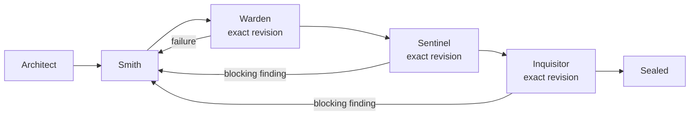

# Configuration

Anvil's Forge reads `.omp/orchestrator.yml` from the project workspace and validates it before a run spends model tokens. The filename is an internal, historical storage name; the user-facing command is `/forge` (`/orchestrate` remains an equivalent compatibility alias).

## Workflow and command surface

The V1 workflow is fixed in the implementation. Configuration selects the specialists and gates; it does not redefine the state machine:



Use the Forge command to validate the installation and manage runs:

```text
/forge doctor
/forge start "Describe the change to make"
/forge status [run-id]
/forge resume <run-id>
/forge findings [run-id]
/forge cancel <run-id>
```

The compatibility alias accepts the same subcommands, but new scripts should use `/forge`.

## Configuration responsibilities

The V1 configuration controls:

- `version` and the named workflow;
- agent names for planning, implementation, security, and review;
- deterministic checks, requiredness, and per-check timeouts;
- security and review policies and retry limits;
- implementation retry limits;
- total token, request, transition, and wall-clock budgets;
- handoff and durable-memory limits;
- persistence options and safety flags.

Model and provider choices remain in the host OMP model-role settings. Anvil does not select a provider for you. The default agent definitions use the configured aliases, for example:

```yaml
modelRoles:
  orch_plan: "provider/planner:xhigh"
  orch_impl: "provider/coding:xhigh"
  orch_security: "provider/security:xhigh"
  orch_review: "provider/review:high"
```

Agent mappings point to discoverable OMP agent names:

```yaml
agents:
  planner:
    agent: orchestrator-planner
  implementation:
    agent: orchestrator-implementation
  security:
    agent: orchestrator-security
  review:
    agent: orchestrator-reviewer
```

All four configured names are checked by `/forge doctor` and at run startup. A missing agent is reported before model work begins.

## Revision and gate behavior

Smith is the mutating stage. Warden runs the configured checks after each implementation mutation. Sentinel and Inquisitor are read-only gates over the exact current workspace revision. A failure or blocking finding returns the run to Smith; the correction path then passes through Warden, Sentinel, and Inquisitor again.

A gate pass is usable only when its revision, effective configuration, and gate policy still match the current run. If the workspace changes after a gate, Forge invalidates that result rather than treating it as current.

## Persistence

Runtime state defaults to `.omp/.orchestrator/`, another internal storage name retained for continuity. It contains SQLite state, the effective configuration, bounded handoffs, structured outputs, and command logs. Rendered prompts are not persisted by default.

You may set a different persistence root through the `persistence.root` option. Runtime files are kept separate from the workspace revision; source edits remain subject to revision checks. See [Persistence and recovery](../README.md#persistence-and-recovery) for the runtime layout and recovery behavior.
