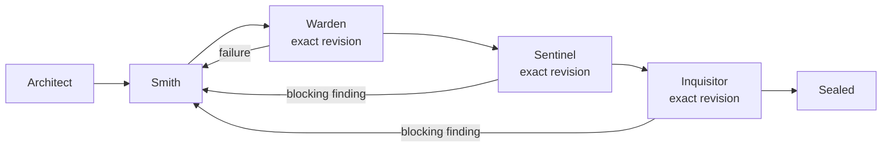

# Configuration

Forge assembles an effective configuration before a run. The global user settings file is loaded by default, and an optional repository overlay can override it. The filename `.omp/orchestrator.yml` is an internal, historical storage name; the user-facing command is `/forge` (`/orchestrate` remains an equivalent compatibility alias).

## Configuration locations and precedence

Settings are merged in this order:

1. built-in `DEFAULT_CONFIG`;
2. the global user file, `$XDG_CONFIG_HOME/omp/anvil.yml`;
3. the nearest project overlay, `.omp/orchestrator.yml`.

If `XDG_CONFIG_HOME` is not set, the global path is `~/.config/omp/anvil.yml`. Both configuration files are editable YAML. The global file is optional; when it is absent, Forge continues with built-in defaults.

On the first OMP session after installation, Anvil automatically creates the global file if it is missing and shows a notification with the path to edit. It does not modify the current repository during this automatic setup. Existing global settings are left unchanged, so the notification is not repeated on later sessions.

Run `/forge init` when you also want to create a repository overlay safely:

```text
/forge init
```

Initialization creates the missing global file and, at the repository root, creates a small editable `.omp/orchestrator.yml` overlay only when neither the canonical project file nor an alternate repository settings file is present. It never overwrites existing global, canonical, or alternate settings. Running initialization from a repository subdirectory still targets that repository root. If existing settings are found, initialization reports them instead of replacing them. When an alternate is detected without a canonical project file, project initialization is skipped and the alternate path is reported for inspection or migration.

For migration and inspection, initialization also reports these alternate candidates when present:

```text
.omp/orchestrator.json
.omp/anvil.yml
.anvil.yml
anvil.yml
```

The existing canonical project settings filename remains supported as `.omp/orchestrator.yml`, and the runtime directory remains supported under `.omp/.orchestrator/`. Those historical names are independent of the `/forge` and `/orchestrate` command spellings.

The generated project overlay is intentionally sparse so shared global values continue to apply. Add only repository-specific overrides, for example:

```yaml
# $XDG_CONFIG_HOME/omp/anvil.yml
agents:
  implementation:
    agent: orchestrator-implementation
checks:
  - id: typecheck
    command: [deno, task, typecheck]
    required: true
    timeoutMs: 180000
```

```yaml
# <repository-root>/.omp/orchestrator.yml
agents:
  implementation:
    agent: my-repository-implementation
checks:
  - id: lint
    command: [deno, task, lint]
    required: true
    timeoutMs: 120000
```

Here the project-specific agent replaces the global implementation agent, and the project `checks` list is the repository's configured checks list. Other global and default settings remain in effect.

## Workflow and command surface

The V1 workflow is fixed in the implementation. Configuration selects the specialists and gates; it does not redefine the state machine:



Use the Forge command to validate the installation and manage runs:

```text
/forge doctor
/forge init
/forge start "Describe the change to make"
/forge status [run-id]
/forge resume <run-id>
/forge findings [run-id]
/forge cancel <run-id>
```

The compatibility alias accepts the same subcommands, but new scripts should use `/forge`.

## Configuration responsibilities

The V1 configuration controls:

- `version` and the named workflow;
- agent names for planning, implementation, security, and review;
- deterministic checks, requiredness, and per-check timeouts;
- security and review policies and retry limits;
- implementation retry limits;
- total token, request, transition, and wall-clock budgets;
- handoff and durable-memory limits;
- persistence options and safety flags.

Model and provider choices remain in the host OMP model-role settings. Anvil does not select a provider for you. The default agent definitions use the configured aliases, for example:

```yaml
modelRoles:
  orch_plan: "provider/planner:xhigh"
  orch_impl: "provider/coding:xhigh"
  orch_security: "provider/security:xhigh"
  orch_review: "provider/review:high"
```

Agent mappings point to discoverable OMP agent names:

```yaml
agents:
  planner:
    agent: orchestrator-planner
  implementation:
    agent: orchestrator-implementation
  security:
    agent: orchestrator-security
  review:
    agent: orchestrator-reviewer
```

All four configured names are checked by `/forge doctor` and at run startup. A missing agent is reported before model work begins.

## Revision and gate behavior

Smith is the mutating stage. Warden runs the configured checks after each implementation mutation. Sentinel and Inquisitor are read-only gates over the exact current workspace revision. A failure or blocking finding returns the run to Smith; the correction path then passes through Warden, Sentinel, and Inquisitor again.

A gate pass is usable only when its revision, effective configuration, and gate policy still match the current run. If the workspace changes after a gate, Forge invalidates that result rather than treating it as current.

## Persistence

Runtime state defaults to `.omp/.orchestrator/`, another internal storage name retained for continuity. It contains SQLite state, the effective configuration, bounded handoffs, structured outputs, and command logs. Rendered prompts are not persisted by default.

You may set a different persistence root through the `persistence.root` option. Runtime files are kept separate from the workspace revision; source edits remain subject to revision checks. See [Persistence and recovery](../README.md#persistence-and-recovery) for the runtime layout and recovery behavior.
