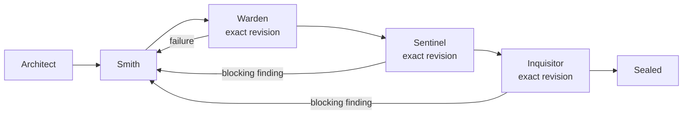

# Configuration

Forge assembles an effective configuration before a run. The global user settings file is loaded by default, and an optional repository overlay can override it. The canonical project overlay is `.omp/anvil.yml`; `/forge` runs an objective and `/anvil` manages configuration, diagnostics, runs, and updates.

## Configuration locations and precedence

Settings are merged in this order:

1. built-in `DEFAULT_CONFIG`;
2. the global user file, `$XDG_CONFIG_HOME/omp/anvil.yml`;
3. the nearest project overlay, `.omp/anvil.yml`.

If `XDG_CONFIG_HOME` is not set, the global Anvil path is `~/.config/omp/anvil.yml`. OMP's global model-role mappings are stored in `~/.omp/agent/config.yml` by default, or in `$PI_CODING_AGENT_DIR/config.yml` when a custom agent directory is active. Named profiles use their profile agent directory. Both configuration files are editable YAML. The Anvil global file is optional; when it is absent, Forge continues with built-in defaults.

On the first OMP session after installation, Anvil automatically creates the Anvil global file if it is missing and shows a notification with the exact path to edit. A new OMP session or restart of OMP is required after installation so Anvil can load and perform this setup. It does not modify the current repository during this automatic setup. Existing global settings are left unchanged, so the notification is not repeated on later sessions.

Inspect the active paths and verify the installation:

```text
/anvil config
/anvil doctor
/anvil init
/anvil update check
```


Initialization creates the missing global file and, at the repository root, creates a small editable `.omp/anvil.yml` overlay. It never overwrites existing global or project settings. Running initialization from a repository subdirectory still targets that repository root. If either file already exists, initialization reports it instead of replacing it.
`/anvil config` reports the effective configuration as `STATUS VALID` even when the optional global file is absent, because built-in defaults remain usable. It also marks the global file and project overlay as `present` or `not present`; run `/anvil init` when this repository needs its `.omp/anvil.yml` overlay.


The generated project overlay is intentionally sparse so shared global values continue to apply. Add only repository-specific overrides, for example:

```yaml
# $XDG_CONFIG_HOME/omp/anvil.yml
agents:
  implementation: # Smith
    agent: smith
checks:
  - id: typecheck
    command: [deno, task, typecheck]
    required: true
    timeoutMs: 180000
```

```yaml
# <repository-root>/.omp/anvil.yml
# Values here override the global settings for this repository.
agents:
  implementation: # Smith
    agent: my-repository-smith
checks:
  - id: lint
    command: [deno, task, lint]
    required: true
    timeoutMs: 120000
```

Here the project-specific agent replaces the global implementation agent, and the project `checks` list is the repository's configured checks list. Other global and default settings remain in effect.

## Workflow and command surface

The V1 workflow is fixed in the implementation. Configuration selects the specialists and gates; it does not redefine the state machine:



Use `/forge` with the objective itself as the start point:

```text
/forge "Describe the change to make"
```

Use `/anvil` for configuration and run management:

```text
/anvil config
/anvil doctor
/anvil init
/anvil status [run-id]
/anvil resume <run-id>
/anvil findings [run-id]
/anvil cancel <run-id>
/anvil update check|install
```


## Configuration responsibilities

The V1 configuration controls:

- `version` and the named workflow;
- agent mappings for Architect, Smith, Sentinel, and Inquisitor;
- deterministic Warden checks, requiredness, and per-check timeouts;
- Sentinel and Inquisitor policies and retry limits;
- Smith retry limits;
- optional total and per-role token caps, plus request, transition, and wall-clock budgets;
- handoff and durable-memory limits;
- persistence options and safety flags.

Model and provider choices remain in the host OMP model-role settings. Anvil does not select a provider for you. The default agent definitions use the canonical role aliases:

```yaml
modelRoles:
  architect: "provider/planner:xhigh"
  smith: "provider/coding:xhigh"
  sentinel: "provider/security:xhigh"
  inquisitor: "provider/review:high"
```

Warden runs deterministic checks and has no model role. Agent mappings point to discoverable OMP agent names:

```yaml
agents:
  planner: # Architect
    agent: architect
  implementation: # Smith
    agent: smith
  security: # Sentinel
    agent: sentinel
  review: # Inquisitor
    agent: inquisitor
```

All four configured names are checked by `/anvil doctor` and at Forge run startup. A missing agent is reported before model work begins.

## Optional token limits

Total and per-role token caps are disabled by default. Token usage is still recorded, including cache reads reported by OMP; it is separate from your provider's remaining subscription allowance. Request, transition, wall-clock, and attempt guardrails remain enabled.

Set a positive numeric cap only when you want one. Omitted values inherit a configured global cap; use `null` in the project overlay to disable it:

```yaml
budgets:
  maxTotalTokens: null
  perRole:
    planner:
      maxTokens: null
    implementation:
      maxTokens: null
    security:
      maxTokens: null
    review:
      maxTokens: null
```

Budgets are checked between stages and before another role attempt, not during individual model calls. An attempt can therefore exceed an explicitly configured cap before the run pauses.

If a run pauses on a budget, raise or remove the relevant cap and use `/anvil resume <run-id>`. Resume applies the current `budgets` settings while preserving all accumulated usage, attempts, and completed work. If another configured cap remains exhausted, the run stays paused and reports that blocker. Pausing and unblocking do not consume workflow transitions.

Other workflow settings must still match the saved effective configuration; budget changes do not invalidate prior gate evidence or authorize changes to checks and review policy.

## Revision and gate behavior

Smith is the mutating stage. Warden runs the configured checks after each implementation mutation. Sentinel and Inquisitor are read-only gates over the exact current workspace revision. A failure or blocking finding returns the run to Smith; the correction path then passes through Warden, Sentinel, and Inquisitor again.

A gate pass is usable only when its revision, effective configuration, and gate policy still match the current run. If the workspace changes after a gate, Forge invalidates that result rather than treating it as current.

## Persistence

Runtime state defaults to `.omp/.anvil/`. It contains SQLite state, the effective configuration, bounded handoffs, structured outputs, and command logs. Rendered prompts are not persisted by default.

You may set a different persistence root through the `persistence.root` option. Runtime files are kept separate from the workspace revision; source edits remain subject to revision checks. See [Persistence and recovery](../README.md#persistence-and-recovery) for the runtime layout and recovery behavior.
